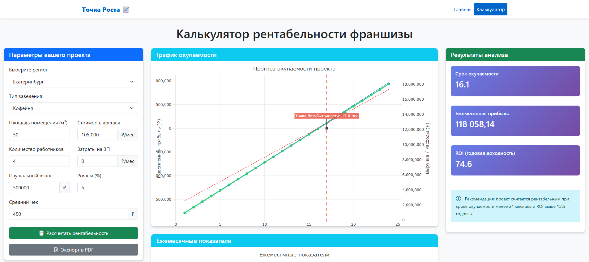

# 📊 Точка Роста
### Это система анализа рентабельности франшиз общепита с учетом региональных особенностей России. Профессиональный инструмент для начинающих предпринимателей.

## 📈 Цель проекта:
### Помочь предпринимателям задумывающимся о покупке франшизы в прогнозировании рентабельности определённого проекта с возможностью использования индивидуальных параметров каждого пользователя.

### Внешний вид главной страницы сервиса:
### Внешний вид страницы расчёта сервиса: 

## ⚙️ Алгоритм работы сервиса:
### 1) Нажмите на кнопку **"Начать расчёт"** на главной странице
### 2) В меню **"Параметры проекта"** выберите подходящий вам вариант в меню регионов
### 3) При необходимости укажите подходящие вам параметры: **"Площадь помещения (м²)", "Количество работников", "Паушальный взнос", "Средний чек"**
### 4) При желании можно **экспортировать результаты анализа в формате PDF**

## 🌟 Основные возможности
### Расчет финансовых показателей:
* Срок окупаемости инвестиций (в месяцах)
* Ежемесячная чистая прибыль
* Годовая доходность (ROI)
* Точка безубыточности
### Региональная адаптация:
* Автоматический расчет арендной платы с учетом площади и региона
* Расчет заработной платы с региональными коэффициентами
* Учет покупательской способности и пешеходного трафика
### Визуализация данных:
* Интерактивные графики окупаемости проекта
* График ежемесячной динамики выручки, расходов и прибыли
* Возможность изменения масштаба для детального анализа
### Экспорт результатов:
* Генерация профессиональных PDF-отчетов с анализом
* Сохранение всех графиков и финансовых показателей
## 🛠 Технологии
* **Backend:** Python 3.13, Django 6.0
* **Frontend:** Bootstrap 5, Plotly.js
* **Аналитика:** Plotly
* **База данных:** SQLite (локально), PostgreSQL (продакшен)

## ⚙️ Установка и подготовка к локальному запуску проекта: 

1. **Склонировать репозиторий с GitHub ```https://github.com/Cultuly/franchise-roi-analyzer.git```** 
|
2. **Создать виртуальное окружение: ```python -m venv venv```**
|
3. **Скачать зависимости ```pip install -r requirements.txt```**
|
4. **Выполнить миграции** ```python manage.py migrate```
|
5. **Загрузить данные для регионов** **```python manage.py flush --no-input```** **```python manage.py loaddata regions/fixtures/regions.json```**
|
6. **Сбор статических графиков** **```python manage.py collectstatic --clear --noinput```**
|
7. **Запустите сервер** **```python manage.py runserver```**
|
